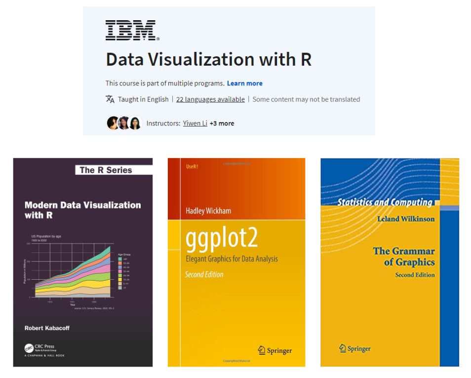

## Gentle Introduction to Data Visualization with R 

This work, as a whole, is licensed under a <a href="https://creativecommons.org/licenses/by-nc-nd/4.0/?ref=chooser-v1" target="_blank" rel="license noopener noreferrer" style="display:inline-block;"> Creative Commons Attribution-NonCommercial-NoDerivatives 4.0 International License </a>

### Georgia State University
### by [Ozlem Tuncel, PhD](https://ozlemtuncel.github.io/)

## Slides
- **[Introduction to Data Visualization with R](https://ozlemtuncel.quarto.pub/data-visualization-in-r/)** by Ozlem Tuncel
  - *This slide is based on materials prepared by [Adam Kuczynski](https://adamkucz.github.io/psych548/), [Charles Lanfear](https://clanfear.github.io/) and [Rebecca Ferrell](https://anth.la.psu.edu/people/rebecca-ferrell/). I am indebted to their code, examples, and inspiration.*
- I recommend checking the other website I created for [introduction to R](https://ozlemtuncel.github.io/introduction-R/).

# My go-to sources for learning visualization in R

I started learning R around 2015 and over time these four resources was my go-to to learn data visualization in R. 

- [Data Visualization with R](https://www.coursera.org/learn/data-visualization-r) on Coursera
- [Modern Data Visualization with R](https://rkabacoff.github.io/datavis/) by Robert Kabacoff
- [ggplot2: Elegant Graphics for Data Analysis (3e)](https://ggplot2-book.org/) by Hadley Wickham
- [The Grammar of Graphics (Statistics and Computing) ](https://www.amazon.com/Grammar-Graphics-Statistics-Computing/dp/0387245448) by Leland Wilkinson

## Very Incomprehensive Sources for Learning Data Visualization R
*If you need more resources on specific things, I have created this incomprehensive list of sources to learn data visualization.*

📦 : R package

⭐: Very Comprehensive Guide (and Ozlem’s Favorite)

🌐: Useful webpage or instruction

📚: Book

### Visualization, ggplot2 packages, and helpers

- ⭐ 🌐 [Data Visualization](https://datavizm20.classes.andrewheiss.com/) — A course by Andrew Heiss
- 📦 [ggpubr](https://rpkgs.datanovia.com/ggpubr/index.html) — Customizes ggplots to create publication ready figures
- 📦 [patchwork](https://patchwork.data-imaginist.com/) — Combines separate ggplots into the same graphic
- 🌐 [ggplot2tor](https://ggplot2tor.com/aesthetics/) — Find the right aesthetics for your visualization
- 🌐 [color blindness simulator](https://laura.rochaprado.com/color-blind-simulator/) — Picking colorblind-friendly colors
- ⭐ 🌐 [R graph gallery](https://r-graph-gallery.com/index.html) — comprehensive gallery for R charts
- 📦 [ggeffects](https://strengejacke.github.io/ggeffects/index.html) — Estimated marginal means and adjusted predictions from regression models
- 📦 [dotwhisker](https://cran.r-project.org/web/packages/dotwhisker/vignettes/dotwhisker-vignette.html) — Plot regression model results
- 🌐 [Plotting interactions](https://stats.oarc.ucla.edu/r/seminars/interactions-r/)
- 🌐 [Plotting interactions among categorical variables](https://cran.r-project.org/web/packages/interactions/vignettes/categorical.html)
- 🌐 [Plotting predicted probabilities](https://www.theanalysisfactor.com/r-glm-plotting/)
- 🌐 [Plotting marginal effects](https://rpubs.com/milesdwilliams15/326345)
- 🌐 [Plotting marginal effects with ggeffects](https://www.sscc.wisc.edu/sscc/pubs/Rmisc/margins.html)
- 🌐 [Plotting residuals](https://drsimonj.svbtle.com/visualising-residuals)
- 🌐 [Gentle Guide to ggplot2](https://pkg.garrickadenbuie.com/gentle-ggplot2/#1)
